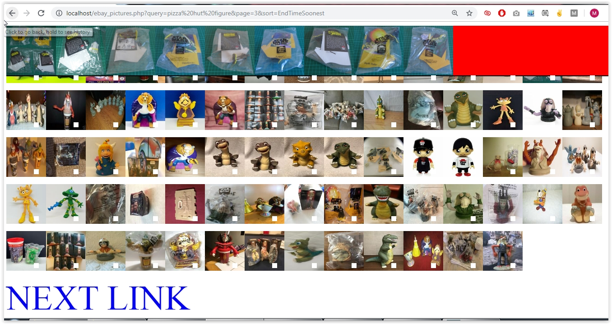

# Ebay API

Nothing special here. Took about a few hours. Just simply uses the EBay API to browse their site & catalog faster. It can be searched by users. Just like a lot of my own code, it is done more for myself and not for end users. You could tell a developer made this, as this very minimalistic design simply did what I did. I usually use the API of every site/service when it's needed for speed & save time & help with development.

Clicking on the picture shows all the images on the top (fixed div), and clicking on the white box goes to the official Ebay Product page

Language: PHP (used until 2015)

